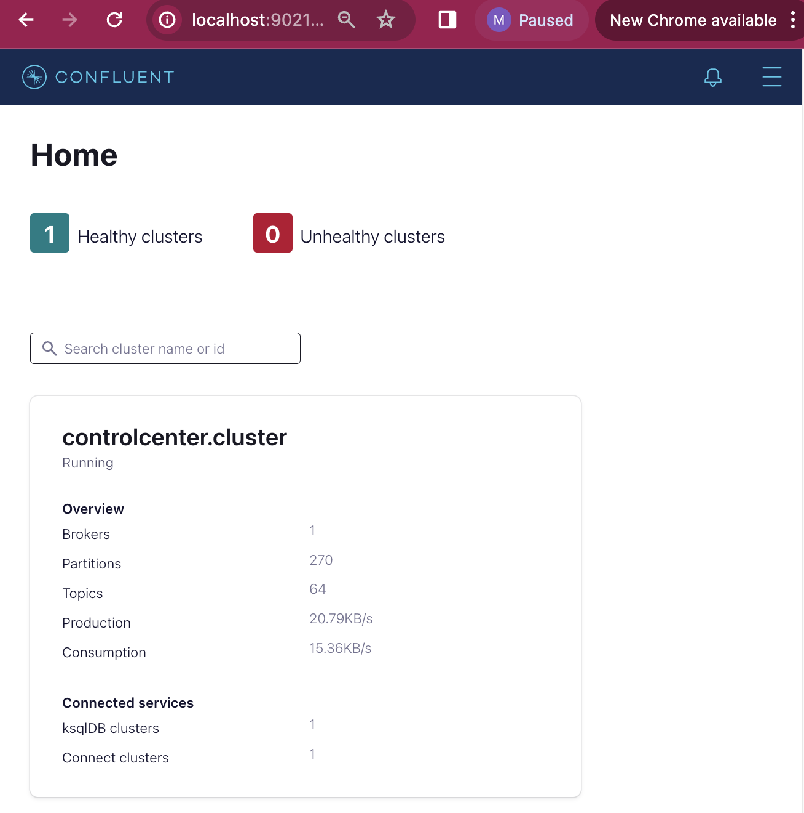
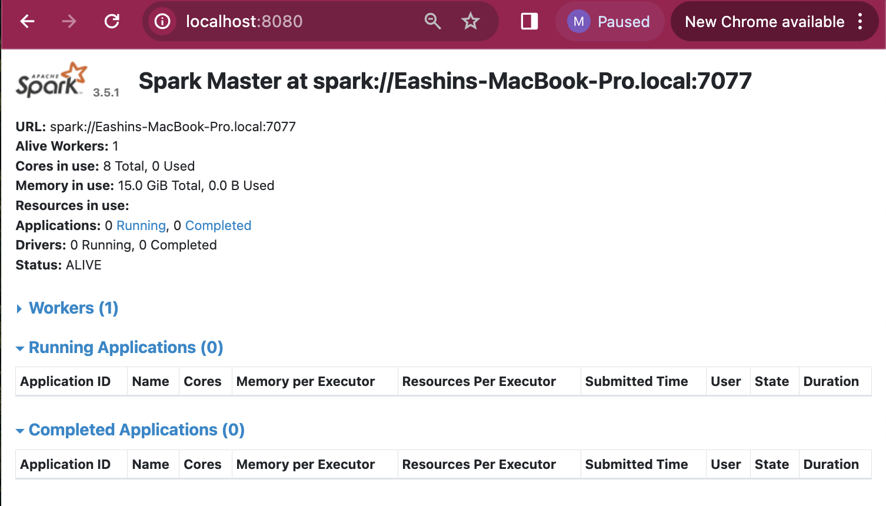

### Deployment/installation guide

> **Note:**
> This deployment was done,tested and verified using Mac OS M2 local environment and it may differ if you use in other OS or environment. 

#### Pre requisities :

- Docker
- Docker compose 3.7
- Java JDK 11
- scala 3.4.0
- python3
- pip3
- Homebrew for mac OS

>I used Amazon distribution of OpenJDK 11
[Amazon Corretto 11 for macOS ](https://docs.aws.amazon.com/corretto/latest/corretto-11-ug/macos-install.html)

#### Prepare and run Kafka Cluster

**1.** Using a ``Terminal`` window Navigate to the directory -

``` 
assignment-3-1033843/code/mysimbdp 
```

**2.** Prepare and start kafka-confluent, Spark and MongoDB, executing the `mysimbdp-up.sh` file with below command - 

````
bash mysimbdp-up.sh
````

> Downloaded Apache Kafka Confluent from official archive - [Apache Kafka Confluent](https://packages.confluent.io/archive/7.4/confluent-7.4.4.zip)

> Installed Latest version of [Spark](https://spark.apache.org/downloads.html) using `homebrew`

> Up and Running a minimal ( 1 config server, 1 router & 2 shard instances) [MongoDB sharded cluster](https://www.mongodb.com/docs/rapid/tutorial/deploy-shard-cluster/) container on docker. 

**3.** **Setup the $PATH environment variable**

For simplified `Terminal` command use of kafka Confluent cluster & Spark it is reccomended (used in this demo) to edit your PATH variable to your system, add below line in `~/.zshrc` file on mac and reload the `Terminal` `source ~/.zshrc`. 
Note: it may vary and should do acordingly as your system. 

```
export CONFLUENT_HOME=/<your>/<path>/<to>/confluent-7.4.4
export PATH=$PATH:$CONFLUENT_HOME/bin
export SPARK_HOME=/opt/homebrew/Cellar/apache-spark/<version>/libexec
export PYSPARK_PYTHON=/opt/homebrew/bin/python3
export PATH=$SPARK_HOME/bin:$PATH
export PATH=$SPARK_HOME/sbin:$PATH
```
**4.** **Apache kafka Confluent Cluster** Run Kafka confluent cluster by using the command below -

````
confluent local services start
````
Expected console output should be similar as following - 


> Nevigate to the http://localhost:9021 to use Kafka Confluent UI.



**5.** **Create kafka Topics** create 4 kafka topics with number of partitions 3 ( as below listed name) using confluent UI for our future use -

- stream-topic-1
- stream-topic-2
- battery-alert-topic

To stop kafka confluent, use following command -

```
confluent local services stop
```

**6.** **Apache Spark Cluster** 

>It is configurable to increase spark workers in the cluster (as you install with `homebrew`), nevigate to `/opt/homebrew/Cellar/apache-spark/3.5.1/libexec/con`directory - 

```
cp spark-env.sh.template spark-env.sh
```

Edit `spark-env.sh` and add this in the file - 
```
export SPARK_WORKER_INSTANCES=2
```
We are running an stand-alone spark for simplified local environment. 
Run spark cluster by using the command below -
 
````
bash start-all.sh
````
Expected console output should be similar as following - 


> Nevigate to the http://localhost:8080 to use Spark UI.



To stop Spark, use following command -

```
bash stop-all.sh
```

**7.** **Python Environment setup** Run the following commands to create & activate a Python 3 virtual environment -

```
python3 -m venv venv
```

```
source venv/bin/activate
```
**8.** Run the following command to install required dependencies

```
pip3 install -r requirements.txt
```

#### Part 2 - streaming analytics

**1.** Using a `Terminal` window Navigate to the directory -

`assignment-3-1033843/code/mysimbdp/stream-app` 

**2.** Tanants can run the manager app on-demand with the following command -

```
python3 manager.py
```

> Once the manager activated it will ask for username. in our case we have parallelism of 2 instances, we have 2 client and username - `client-1` `client-2`. Near real-time streaming data ingestion is ready to use by running the manager app. To stop the app simply write `exit` OR press `ctrl+C`on keyboard.
**Note:** all teanants should follow the constraints provided. Run `python3` commands fron activated python virtual environment.
