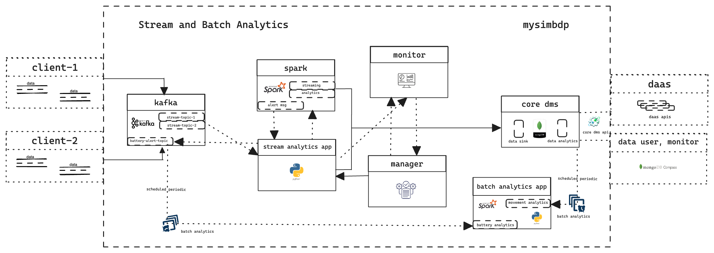
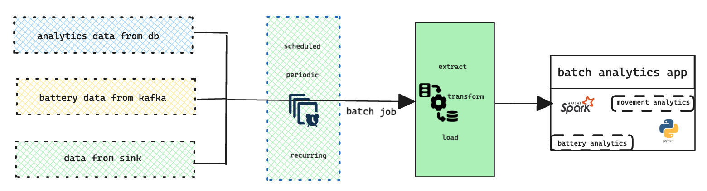
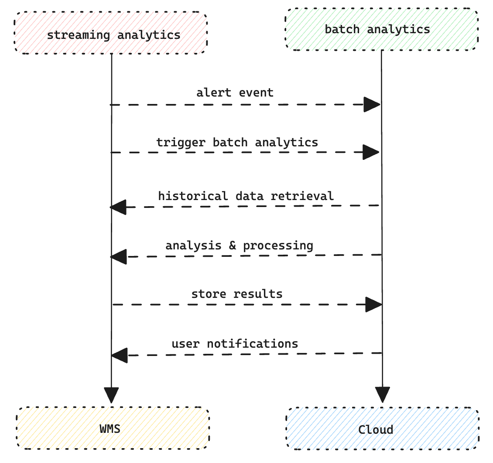

# Assignment 3 report - Stream and Batch Processing

### Part 1 - Design for streaming analytics

>**1.** As a tenant, select a dataset suitable for streaming data analytics as a running scenario. Explain the dataset and why the dataset is suitable for streaming data analytics in your scenario. As a tenant, present at least two different analytics: 

I have selected the IoT dataset from the monitoring devices at Korkeasaari Zoo, concentrating on the monitoring device battery level alert and movement behaviour information of the turtles in certain weather condition, as a tenant looking to take advantage of advanced data analytics capabilities. The continuous and dynamic nature of this data makes it an ideal situation for various data analytics. Below are the information od chosen data-

```
dataset:  time,           # Time When data generated
          readable_time,  # Generated time in human readable format
          acceleration,   # Tortoise movement data
          acceleration_x, # Tortoise movement data of X direction
          acceleration_y, # Tortoise movement data of Y direction
          acceleration_z, # Tortoise movement data of Z direction
          battery,        # Battery level data of the device 
          humidity,       # Environmental humidity data
          pressure,       # Environmental pressure data
          temperature,    # Environmental temperature data
          dev-id          # Identification data of the device
```

 The real-time data collected from IoT sensors that are produced continuously, taking into account the turtles' continuing actions, environment, dvice batteries and other variables .

>**(i)** a streaming analytics (tenantstreamapp) which analyzes streaming data from the tenant

This dataset—which gathers data in real time from Internet of Things (IoT) sensors in the turtles' habitat—is perfect for streaming data analytics. Timely interventions are made possible via stream analytics, which provides instant insights regarding turtle behaviour, mobility, and battery state.

The real-time insights about turtle movement behaviour, environment and IoT device battery by utilising streaming analytics on the Korkeasaari Zoo IoT dataset. Constantly monitoring acceleration and movement data, the analytics can help to identify issues that could indicate bad weather or possible abnormal behavior of the turtles, enabling timely intervention. Additionally, this application and analytics allows for ongoing data collecting and preventative maintenance by enabling continuous monitoring of the device's battery levels. Through prompt resolution of new problems and device performance optimisation to guarantee device active status, this strategy improves turtle monitoring and habitat management.

>**(ii)** a batch analytics, using the workflow model, which analyzes historical results outputted by the streaming analytics. The explanation should be at a high level to allow us to understand the data and possible analytics so that, later on, you can implement and use them in answering other questions. (1 point)

Furthermore, batch analytics has the ability to retrospectively analyse past data in order to spot long-term trends and patterns. We can improve zoo conservation and habitat management for turtles by utilising both strategies.

The batch analytics component, which utilises streaming analytics to extract past data and offer a thorough understanding of battery performance and weather-related movement patterns. Long-term trends and patterns are found by methodically analysing previous data on device battery levels and turtle movement patterns using this workflow approach. In order to shed light on environmental factors affecting device longevity, batch analytics, for example, can uncover seasonal fluctuations in battery performance and connect them with weather patterns. Similarly, it can identify how variations in the weather affect turtle movement patterns over time, supporting habitat management plans. Tenants can proactively schedule maintenance interventions and obtain significant insight into future device failures by utilising batch analytics. This ensures continuous data collecting and well-informed decision-making on turtle care and habitat management.

>**2.** The tenant will send data through a messaging system, which provides stream data sources. Discuss, explain and give examples for the following aspects in the streaming analytics: 

>**(i)** should the streaming analytics handle keyed or non-keyed data streams for the tenant data

When deciding whether to process keyed or non-keyed data streams for the tenant data in streaming analytics, it is essential to assess the particular use case and the requirements of the tenant. Keyed streams offer a significant advantage when there is a requirement to aggregate data based on a specific key, such as the device ID in our case involving the IoT data from the Korkeasaari Zoo. 

Keyed streams facilitate the management of data organisation and order, enabling efficient operations such as windowing and aggregation. This is achieved by processing events with the same key together. Conversely, non-keyed streams see each data point as an individual event and are appropriate for stateless operations such as filtering or mapping. Nevertheless, if the tenant's analysis does not depend on information peculiar to the device, non-keyed streams may be adequate. An effective approach to handle the calculation of the average temperature or humidity based on devices is by using a keyed stream.

For example, in our case, tenant plans to examine data related to certain devices, employing keyed streams to categorise data according to device ID enables the comparison of temperature measurements or the monitoring acceleration over a period of time so the device id can be the key. 

>**(ii)** which types of message delivery guarantees should be suitable for the stream analytics and why. (1 point)

Stream analytics message delivery assurances depend on tenant needs and data relevance. To enable orderly and full message processing by stream processing applications, Kafka offers multiple delivery guarantees. Spark supports Kafka message processing with at-most-once, at-least-once, and exactly-once semantics. At least-once delivery ensures that all messages are processed, although duplicates may occur, making it acceptable when duplicates are allowed. When message loss is acceptable, at-most-once delivery avoids message duplication but may cause message loss. Real-time turtle behaviour monitoring using the Korkeasaari Zoo's IoT data may benefit from at-least-once delivery, which prioritises data capture. For accurate historical data analysis, exactly-once delivery may be best since it maintains record integrity without duplicates or omissions. Message delivery promises should match tenant goals and data accuracy.

>**3.** Given streaming data from the tenant (selected before). Explain and give examples in your explanation for the following points: 

>**(i)** which types of time should be associated with stream data sources for the analytics and be considered in stream processing (if the data sources have no timestamps associated with records, then what would be your solution)

When it comes to streaming data from the selected tenant, the time associated with stream data sources plays a crucial role in ensuring reliable analytics and processing. Understanding the timing of events is essential, as it signifies the exact moment when events or data points took place. Utilising the "readable_time" column from the Korkeasaari Zoo's IoT data demonstrates a clear illustration, providing a timestamp for event time that corresponds with the actual generation of data points in the real world. 

However, in situations where data sources do not have timestamps, ingestion time becomes a practical alternative. Understanding the ingestion time is crucial for monitoring important performance metrics like latency and throughput. It helps track when data points were transmitted from devices to the platform. 

On the other hand, another option is to consider the processing time, which indicates the arrival of data points on the platform. The time it takes to process information may not always be a reliable indicator of when the event actually occurred, especially in situations where there are delays or network issues during data transmission. By giving priority to event time whenever possible, establish a strong temporal basis for stream processing and analytics.


>**(ii)** which types of windows should be developed for the analytics (if no window, then why)

Several windows can be created for analytics to streamline data processing and analysis. Common window types:

Time-based windows: These windows segment the data stream by time intervals for temporal analysis across fixed durations. Tumbling, sliding, and session windows are examples.

Count-based windows segment the data stream by event or data point count for analysis over preset event counts. They are beneficial when data volume matters more than time intervals.

Session-based windows: These windows group events inside a session or activity period for analysis of user sessions or ongoing activities.

Custom windows: Data segmentation and analysis are flexible using custom windows, which allow for arbitrary window borders based on business requirements.

The window function ` window("readable_time", "1 minute")` represents a time-based sliding window for Korkeasaari Zoo IoT data stream processing. For temporal aggregation and analysis of streaming data, it creates 1-minute fixed-size windows that slide or advance by a given interval. This window setting groups data events by 1-minute intervals, making aggregate calculations like averages, counts, and sums easier. The sliding window allows real-time insights into turtle behaviour and environmental conditions at the zoo by continuously including new data points and dropping older ones.

>**(iii)** what could cause out-of-order data/records with your selected data in your running example

Out-of-order data or records occur when a data stream's chronological sequence is broken, causing events to be processed or presented out of order. A data stream normally carries a timestamp for each event or observation. When events with later timestamps are processed before earlier ones, out-of-order data results in temporal discrepancies. Consider streaming IoT sensor data to a processing system. If sensor events are broadcast and processed out of sequence due to network delays, synchronisation issues, or other circumstances, the processing system may receive data points with non-linear timestamps. 

In our Korkeasaari Zoo IoT data scenario, various things could cause out-of-order data or records:

**Network Latency:** Network transmission delays might cause data records to arrive out of order at the processing system. Data point arrival times can vary according to network constraints, packet routing, or congestion.

**Queuing:** Messages queued or buffered before delivery to the processing system may not arrive in the order events happened. This can be caused by messaging system priority or queue delays.

**Parallel Processing:** If synchronisation methods are not properly established, events may be handled out of order while processing data streams across several threads or nodes. Race circumstances or event interleaving can cause out-of-order data in concurrent processing.

Data records with inaccurate timestamps can also cause out-of-order data. If timestamps are generated or recorded erroneously at the source, the processing system may receive data points with incorrect event order.


>**(iv)** will watermarks be needed or not and explain why.(1 point)

Watermarks serve as timestamps that indicate the maximum event time within a specific window in stream processing. They are skilled at managing delayed data and ensuring that the processing system can safely remove outdated data without compromising the accuracy of the analysis. By integrating watermarks into the stream processing workflow, a threshold can be established to determine when data is considered late. We have the capability to handle data that is not in the correct order and take into consideration any delays in events, all while ensuring the accuracy of our analytics. Similar to a computer systems analyst, the absence of watermarks in the processing system could result in the incorrect discarding or processing of delayed data, which may lead to inaccurate results or incomplete analysis.

When considering our zoo case, setting a watermark using the "readable_time" column of our streaming data is indicated by ` withWatermark("readable_time", "1 minute")`, this watermark indicates that the system should treat the data as fully updated up to 1 minute after the event time mentioned in the "readable_time" column.

Any events that arrive more than 1 minute after their corresponding "readable_time" will be classified as late data. By implementing this watermark, we guarantee that the stream processing engine can effectively manage delayed data, ensuring precise and dependable analysis of the streaming information.

>**4.** List important performance metrics for the streaming analytics for your tenant cases. For each metric, explain 
>**(i)** its definition, 
>**(ii)** how to measure it in your analytics/platform
>**(iii)** its importance and relevance for the analytics of the tenant (for whom/components and for which purposes). (1 point)

**1. Throughput**

Throughputis the speed at which the streaming analytics system processes data, usually measured in events per unit of time, such as seconds or minutes.

**Measurement:** Determine the average number of events handled by the system during a specific time period, such as events per second.

**Importance:** Understanding the throughput of a streaming analytics platform is essential for evaluating its processing capacity and efficiency. This will ensure that the analysis of IoT data from turtle habitats is done in a timely manner, providing real-time insights into turtle behaviour and device battery. It guarantees that the tenant can stay up to date with the constant flow of incoming data to make well-informed decisions quickly.

**2. Latency**

Latency is the duration between when an event happens and when it is processed by the streaming analytics system.

**Measurement:** Determine the mean duration required for an event to go through the entire process from its inception to its analysis.

**Importance:** Achieving low latency is crucial for the purposes of real-time monitoring and decision-making. Minimising delay is crucial for the zoo renter to promptly notice any irregularities or environmental changes that may impact turtle behaviour. It allows for quick reactions to situations, such as device breakdowns.

**3. Fault tolerance**

Fault tolerance refers to the assessment of a system's capacity to maintain smooth operation even in the face of hardware failures, software faults, or network disruptions.

**Measurement:** Evaluate the platform's ability to withstand failures by simulating failure scenarios and observ its capacity to preserve data integrity and sustain service availability.

**Importance:** Fault tolerance is crucial for maintaining the dependability of the streaming analytics platform by preventing data loss and service interruptions. Ensuring fault tolerance is important for the zoo's tenant should allow for uninterrupted monitoring of turtle behaviour and battery. It guarantees continuous data analysis for making well-informed decisions.

**4. Scalability**

Scalability refers to the capacity of a system to effectively manage larger workloads by incorporating additional resources or nodes, while maintaining optimal performance.

**Measurement:** Assess the platform's scalability by conducting performance tests under different load scenarios and noting its smooth ability to adjust its capacity up or down.

**Importance:** Scalability enables the accommodation of increasing data volume and processing needs as time progresses. Scalable streaming analytics guarantees that the zoo tenant can efficiently manage variations in data input.

>**5.** Provide a design of your architecture for the streaming analytics service in which you clarify: tenant data sources, mysimbdp messaging system, mysimbdp streaming computing service, tenant streaming analytics app, mysimbdp-coredms, and other components, if needed. Explain your choices of technologies for implementing your design and reusability of existing assignment works. Note that the result from tenantstreamapp will be sent back to the tenant in near real-time and/or will be ingested into mysimbdp-coredms. (1 point)


*Figure 1 : mysimbdp stream and batch processing*

In the Figure 1, illustrates the streaming and batch analytics service in which - 

client-1 and client-2 are tenant's data sources as the tenant's side message sender which messages are generated by IoT devices of the zoo turtles. 

Apache kafka is the mysimbdp messaging system which having the steeam-topic-1 and stream-topic-2 for receiving messages from respective clients. mysimbdp messaging system also having battery-alert-topic for incoming alert message from stream analytics application. 

mysimbdp streaming computing service is Apache spark, which will compute for streaming ingestion , analytics and alert message send back to messaging system for further use by clients and possible batch analytics. 

tenant streaming analytics app here is stream analytics app which will consume data from messaging system, process and send to spark for further compution and then sink the data to core dms as well as send back message to messaging system. 

mysimbdp-coredms, a big data storage for mysimbdp to store and manage large datasets and its adaptability to unstructured and semi-structured data for different tenants and different models. MongoDB is the preferred Backend Database Management System (BDMS).

mongoDb Compass is a third party component which will act as an external user or monitor via core-dsm api.

### Part 2 - Implementation of streaming analytics

>**1.** As a tenant, implement a tenantstreamapp. For code design and implementation, explain 

I have reused some part of my assignment 2 implementations, which was suitable to implement this tenantstreamapp. This tenantstreamapp developed by python programming and used python library for spark and kafka. 

>**(i)** the structures/schemas of the input streaming data and the analytics output/result in your implementation, the role/importance of such schemas and the reason to enforce them for input data
and results.

In the context of this zoo IoT data streaming analytics application the below shema applied -

```
schema = StructType([
    StructField("time", LongType()),
    StructField("readable_time", TimestampType()),
    StructField("acceleration", DoubleType()),  
    StructField("acceleration_x", IntegerType()),
    StructField("acceleration_y", IntegerType()),
    StructField("acceleration_z", IntegerType()),
    StructField("battery", IntegerType()),
    StructField("humidity", DoubleType()),
    StructField("pressure", DoubleType()),
    StructField("temperature", DoubleType()),
    StructField("dev-id", StringType())
])
```
Implemented schema of the input streaming data is crucial for maintaining data consistency, integrity, and compliance with the analytics pipeline. The incoming data's structure is defined, enabling the streaming analytics platform to accurately parse, process, and analyse the data.

Implementing above schema for input streaming data guarantees that all incoming data conforms to a predetermined format. This feature aids in the prevention of errors during the process of collecting data, improves the overall quality of the data, and enables smooth integration with subsequent analytics procedures. By implementing schema validation, the system may consistently and reliably manage a variety of data sources.

The analytics output/result schema specifies the format and organisation of the data or insights produced by the streaming analytics platform. The output may consist of consolidated statistics, anomaly detection outcomes, or additional calculated metrics derived from the input data.

The output schema defines the structure and characteristics of the analytics results, allowing downstream applications or users to accurately interpret and effectively utilise the insights. It guarantees clearness, uniformity, and interoperability with data visualisation tools, reporting systems, or other endpoints for data consumption.

Implementing this output schema ensures that data consistency and interoperability are maintained throughout the various components of the analytics pipeline. It allows for smooth connectivity with external systems, streamlines automated workflows, and improves the readability and accessibility of analytics outputs.

>**(ii)** the data serialization/deserialization for the streaming analytics application (tenantstreamapp). (1 point)

**Deserialisation from Kafka** 

```
.select(from_json(col("kafka_value"), schema).alias("data"))
.select("data.*")
```

The data is deserialised from Kafka by utilising the from_json function that is made available by PySpark. This method translates Kafka messages that are formatted in JSON into rows that are structured in Spark DataFrame framework. When it comes to proper parsing, this process makes use of the schema that was supplied. The from_json function of PySpark is the mechanism and library that was used.

Deserialised structured data from Kafka message values using the schema. This occurs during `.select`operation with `from_json` which deserialises JSON-formatted Kafka message values into schema-compliant structured data.


**Serialisation for kafka**

```
.selectExpr("CAST(`dev-id` AS STRING) AS key", "to_json(struct(*)) AS value")
```

PySpark's to_json function is used to serialise data for Kafka. This method is offered by PySpark. This method takes rows from a DataFrame and turns them into strings that are formatted in JSON and are suitable for transmission across Kafka topics. The to_json function of PySpark was utilised as a library. 

This takes place while the `.selectExpr` procedure is being performed with `to_json` which is responsible for serialising the dataFrame into the JSON format here.


**MongoDB serialisation**

```
# writting df to mongoDB data sink collection
    .foreachBatch(lambda df, epoch_id: df.write.format("mongo").mode("append").option("database", "stream_zoo").option("collection", "tortoise").save())
# writting analytics to mongoDB data analytics collection
    .foreachBatch(lambda df, epoch_id: df.write.format("mongo").mode("append").option("database", "stream_zoo").option("collection", "zoo_analytics").save()) 
```

The data is transformed into BSON format, which is specifically designed for MongoDB, using the MongoDB connection that is integrated into PySpark. The connector facilitates the transformation of DataFrame rows into BSON format for the purpose of storing them in MongoDB by utilising PySpark's and MongoDB connection libraries.

This occurs implicitly by the MongoDB connector during the `.foreachBatch` operation.

>**2.** Explain the logic of the functions for processing events/records in tenantstreamapp in your implementation. Explain under which conditions/configurations and how the results are sent back to the tenant in a near real time manner and/or are stored into mysimbdp-coredms as the final sink. (1 point)

**tenantstreamapp** processes events/records from the Kafka topic, identifies low battery alerts and send to kafka topic, performs analytics, and writes the results in near real-time to MongoDB collections, all within the Spark Structured Streaming framework.

**tenantstreamapp** having multiple functions to process events/records from the input Kafka topic and stores the outcomes in MongoDB in near real-time as the end destination. Below is a detailed explanation of the reasoning behind the logic and the corresponding code snippets:

**Consuming data from Kafka:**

```
df = (
   spark.readStream.format("kafka")
   .option("kafka.bootstrap.servers", "localhost:9092")
   .option("subscribe", "stream-topic-1")
   .option("startingOffsets", "latest")
   .load()
   .selectExpr("CAST(value AS STRING) as kafka_value")
   .select(from_json(col("kafka_value"), schema).alias("data"))
   .select("data.*")
)
```

This part of tenantstreamapp first generates a Spark DataFrame `df` that reads data from the Kafka topic named `stream-topic-1`. The purpose of this is to define the structure of the DataFrame in order to accurately deserialize the JSON messages received from Kafka into a pyspark usable format.

**Filtering for Low Battery Alerts:**

```
low_battery_df = df.filter(col("battery") < 2000)
```

Applying a filter to identify and isolate low battery devices.

The logic applies a filter to the DataFrame `df` in order to find records that have a battery value below 2000. This process results in the creation of a new DataFrame called `low_battery_df`.

**Sending Low Battery Alerts to Kafka:**

```
battery_alert_query = (
   low_battery_df.selectExpr("CAST(`dev-id` AS STRING) AS key", "to_json(struct(*)) AS value")
   .writeStream
   .format("kafka")
   .option("kafka.bootstrap.servers", "localhost:9092")
   .option("topic", "battery-alert-topic")
   .option("checkpointLocation", checkpoint_battery_alert)
   .start()
)
```

The DataFrame `low_battery_df` is selected and serialized into JSON format before being sent to the Kafka topic `"battery-alert-topic"` for further processing as `battery_alert_query`during streaming.

**Analysing data:**

```
analytics = (
   df.filter((col("temperature") > 20) & (col("humidity").between(30, 40)))
   .withWatermark("readable_time", "1 minute")
   .groupBy(window("readable_time", "1 minute"), "dev-id")
   .agg(
       avg("temperature").alias("avg_temperature"),
       avg("acceleration").alias("avg_acceleration"),
       count("*").alias("total_records")
   )
   .withColumn("throughput", col("total_records") / 60)
)
```

This part of code snippet of tenantstreamapp performs filtering and windowing techniques on the DataFrame df to detect records with a temperature exceeding value 20 and a humidity value ranging from 30 to 40. The mysimbdp streaming computing service computes the average temperature, average acceleration, and total number of records at 1-minute intervals, while also including a column for throughput.

**Storing data in MongoDB:**

```
query_df = (
   df.writeStream
   .outputMode("append")
   .foreachBatch(lambda df, epoch_id: df.write.format("mongo").mode("append").option("database", "stream_zoo").option("collection", "tortoise").save())
   .trigger(processingTime="1 second")
   .option("checkpointLocation", checkpoint_query_df)
   .start()
)

query_analytics = (
   analytics.writeStream
   .outputMode("update")
   .foreachBatch(lambda df, epoch_id: df.write.format("mongo").mode("append").option("database", "stream_zoo").option("collection", "zoo_analytics").save())
   .trigger(processingTime="60 second")
   .option("checkpointLocation", checkpoint_query_analytics)
   .start()
)

```

There are two distinct streaming queries, namely `query_df` and `query_analytics`, that are implemented to write the results in near real-time to MongoDB collections named `tortoise` and `zoo_analytics`, respectively. And this data sinking and analytics happen near real-time while data streaming continues. `.trigger(processingTime="1 second")` for the query which is the near real-time streaming for all incoming data and `.trigger(processingTime="60 second")`another query for analytics data and 1 minute trigger tinterval is suitable for the usecase. 


>**3.** Explain a test environment for testing tenantstreamapp, including how you emulate streaming data, configuration of mysimbdp and other relevant parameters. 

My tenantstreamapp test environment setup and configurations:

- Use Apache Kafka's integrated Confluent Kafka distribution on a macOS M2 system. Configure Kafka brokers, topics, and partitions.

- Emulate streaming data with a Kafka producer script or application. This producer will replicate tenantstreamapp user-specific Kafka topic messages.

- Run streaming analytics on macOS by installing Apache Spark locally. Use Spark's standalone cluster mode or local mode for testing.

- Configure tenantstreamapp to consume Kafka topics and execute Apache Spark streaming analytics. Simulate real-world situations using application parallelism, windowing, and other characteristics.

- Configure the data management system for historical data and batch analytics testing. Set up mysimbdp to store necessary datasets and meet tenantstreamapp's input criteria.

- Use file naming standards and dataset formats to replicate realistic circumstances and test tenantstreamapp's behaviour.

- Separate tenantstreamapp users' Kafka topics to isolate data streams and enable independent testing and analysis. Adjust topic, partition, and replication factors.

- Continuously send messages to Kafka topics to emulate flowing data. Change message content, frequency, and volume to replicate data scenarios and test tenantstreamapp's performance and scalability.

- Track data processing, failures, and performance metrics while testing with tenantstreamapp. Use Kafka's consumer lag metrics for real-time monitoring and used logic within stream app to produce performance metrics and saved as log file and with analyutics data save to db.

>Run tenantstreamapp and show the operation of the tenantstreamapp with your test environments. Discuss the analytics and its performance observations when you increase/vary the speed of streaming data. (1 point)

By increasing the speed of streaming data, it is observed that the with the speed throughput is higher and performance is better. But it can cause a failure of streaming analytics which is observed by producing fastest messaging by sleeptime 0, and it failed to process the analytics.

below is the message streaming metrics log -

```
timestamp,sleep,chunk,total,execution-time,per Sec
20240415_192225,5,1,49,4.088272615273794,0.19975836826918014
20240416_080848,5,1,49,4.087680542469025,0.19978730191410382
20240416_082429,5,1,100,8.341683216889699,0.1997998033888542
20240416_083857,5,1,100,8.340924016634624,0.19981798939095594
20240416_084616,3,1,100,5.007572384675344,0.3328292710789685
20240416_085204,1,1,100,1.6745696147282918,0.9952806094221962
20240416_085442,1,1,100,1.674289099375407,0.9954473616822902
20240416_090346,1,1,100,1.675713829199473,0.9946010098053983
```
In analytics streaming and data saving it is observed that by the speed throughput increased 0.2 while with less speed of messaging it is much lower. 

>**4.** Present your tests and explain them for the situation in which wrong data is sent from or is within the data sources. Explain how you emulate wrong data for your tests. Report how your implementation deals with that (e.g., exceptions, failures, and decreasing performance). You should test with different error rates. (1 point)

The Kafka Confluent UI tool makes data production easy, so I used it to test with fake data. By manually entering values that deviated from the schema or format, I purposefully introduced inaccurate or malformed data into Kafka topics. I could mimic missing fields, inaccurate data types, and out-of-range values, which are typical in real-world data streams. I could test the streaming analytics application's resilience and error-handling by inserting incorrect data.

we emulate below data (wrong data, we made the dev-id null while keeping the header) to process throgh messaging system via our app but it did not processed any row -

```
time,readable_time,acceleration,acceleration_x,acceleration_y,acceleration_z,battery,humidity,pressure,temperature,dev-id
1540080018884,2018-10-21T00:00:18.884000Z,1053.0740714688593,223,-410,944,2959,30,1021.03,27.42
1540080024083,2018-10-21T00:00:24.082999Z,1051.1070354630874,216,-411,943,2959,30,1021.03,27.41
1540080029131,2018-10-21T00:00:29.131000Z,1048.4073635758193,217,-415,938,1000,30,1021.04,27.41
1540080034173,2018-10-21T00:00:34.173000Z,1050.0095237663322,218,-414,940,2959,30,1021.03,27.41
1540080039313,2018-10-21T00:00:39.312999Z,1052.7872529623446,216,-413,944,1000,30,1021.03,27.41
1540080044383,2018-10-21T00:00:44.382999Z,1052.9240238497744,218,-410,945,2953,30,1021.03,27.41
1540080049323,2018-10-21T00:00:49.322999Z,1051.4314052756843,220,-412,942,2953,30,1021.03,27.41
1540080054549,2018-10-21T00:00:54.549000Z,1055.087200187738,216,-412,947,2959,30,1021.03,27.41
1540080059533,2018-10-21T00:00:59.532999Z,1051.29348899344,215,-412,943,2959,30,1021.03,27.41
1540080064823,2018-10-21T00:01:04.822999Z,1052.3031882494702,218,-413,943,2959,30,1021.03,27.41
```

In another scenario we forcefully sent the following data (05 sets) to messaging system - 

```
{
	"ordertime": 1497014222380,
	"orderid": 18,
	"itemid": "Item_184",
	"address": {
		"city": "Mountain View",
		"state": "CA",
		"zipcode": 94041
	}
}
```
And, as a result no analytics data at all produced mongoDB and observed that filetring and analytics conditions enforced.

Also, forcefully sent below data (05 sets)to messaging system - 

```
  {
    "time": 1540080018884,
    "acceleration": 1053.0740714688593,
    "acceleration_x": 223,
    "acceleration_y": -410,
    "acceleration_z": 944,
    "battery": 2959,
    "humidity": 30,
    "pressure": 1021.03,
    "temperature": 27.42
  }
```
And, the result was same, no analytics data produced. 

>**5.** Explain parallelism settings in your implementation (tenantstreamapp) and test with different (higher) degrees of parallelism for at least two instances of tenantstreamapp (e.g., using different subsets of the same dataset). Report the performance and issues you have observed in your testing environments. Is there any situation in which a high value of the application parallelism degree could cause performance problems, given your limited underlying computing resources (1 point).

The configuration of parallelism implemented to determine how computing resources are allocated across the Spark cluster. The management of parallelism settings in the application is as follows:

In configuration of spark session dynamic allocation enabled `"spark.dynamicAllocation.enabled", "true"` to enable Spark to automatically modify the number of executors based on the workload. 

The parameter `"spark.dynamicAllocation.initialExecutors", "1"` determines the initial number of executors that are assigned when the application begins.

The parameter `"spark.dynamicAllocation.minExecutors", "1"` specifies the least number of executors that Spark is allowed to allocate.

The parameter `"spark.dynamicAllocation.maxExecutors", "4"` determines the upper limit on the number of executors that Spark can assign.

Each executor is set up with a total of 4 cores, as specified by the spark.executor.cores configuration. This configuration specifies the quantity of CPU cores assigned to each executor for the concurrent execution of tasks.

The value for the number of shuffle partitions is configured to 2. 

```
spark.conf.set("spark.sql.shuffle.partitions", "2")
```

Shuffle partitions determine the level of parallelism for operations that involve shuffling data, such as aggregations and joins. Spark utilises this option as a default to ascertain the quantity of partitions to employ during different stages of computation.

```
checkpoint_battery_alert = "/tmp/spark_checkpoint/battery_alert_1"
checkpoint_query_df = "/tmp/spark_checkpoint/query_df_1"
checkpoint_query_analytics = "/tmp/spark_checkpoint/query_analytics_1"
```
Specific checkpoint sites are designated for various streaming queries, including checkpoint_battery_alert, checkpoint_query_df, and checkpoint_query_analytics. The purpose of these checkpoint locations is to guarantee fault tolerance and enable recovery in the event of processing failures.

I observe the performance of analytics app is lower during parallelism testing, though my internet speed and device performance was not adecuate. 
I only tested 2 instances of applications rul parallely , and therefore was not sure that more number of application paralalleism issues which I consider a limitation of my test environment.

### Part 3 - Extension

>**1.** Assume that you have an external RESTful (micro) service, which accepts a batch of data (processed records), performs an ML inference and returns the result. How would you integrate such a service into your current platform and suggest the tenant to use it in the streaming analytics? 

In order to include the external RESTful (micro) service for ML inference into our existing platform and allow tenants to use it for streaming analytics, we will follow some steps -

**Improve Platform Architecture:**

Integrate a new component into our platform's architecture that will handle the interaction with external services.
Design and develop an application that is capable of managing the transfer of batch data to the machine learning service and receiving the results of the inference.

**Implementation of the connector:**

Develop a custom connector using Python's requests module to communicate with the REST API of the machine learning service.
Implement functions to convert batches of processed records into right accepted format for submission to the ML service.

Develop API endpoints of core dms to extract batch data from database to ML service.

**Configuration of the data flow:**

Configure Apache Kafka topics as queues for transferring batches of records to the machine learning service and if required to the kafka topic. Develop Kafka producers to publish batches of processed records to specified topics.

Integrate Kafka consumers into the ML service connector to process batches of records for inference OR develop another app to consume data to spark.

Integrate developed database API to back and forth data transmitting with ML service and database. 

>Explain what the tenant must do in order to use such a service. (1 point)

Tenants can effectively utilize the external ML inference service within the streaming analytics platform, and they should do their part to integrate it - 

- Sign up for the platform and submit essential details, including the ML service's endpoint URL, authentication credentials, and data format specifications.

- Revise the schema of their data to conform to the anticipated format required by the ML service, which involves altering field names, data types, and including or eliminating features as needed. Conduct any necessary data transformation or preparation to verify that the data given to the machine learning service satisfies its input criteria.

- Set up the platform to send processed data batches to the ML service by specifying the endpoint URL and authentication credentials. Use the given configuration file (e.g., customer_information.json) to store and retrieve the required connection details in the BatchManager class of the platform.

- Obtain the machine learning results from the service by using the identical RESTful API endpoint that was used to retrieve processed data. Integrate the machine learning outcomes into their analytics and reporting processes within the Spark streaming application to improve data analysis and decision-making abilities.

>**2.** Given the output of streaming analytics stored in mysimbdp-coredms. Explain a batch analytics (see also Part 1, question 1) that could be used to analyze such historical output for your scenario. Assume you have to design the analytics with the workflow model

- Periodically extract historical data from mysimbdp-coredms, which includes analytical information about the movement and throughput of turtles.
- Retrieve battery level alarm messages from Kafka topics.
- Use ETL to load analytics data to the batch analytics component, such as movement patterns, average throughput from core dms and battery levels from the kafka topic. 
- Examine the movement patterns of turtles in order to detect recurring behaviours, regions where they rest, and zones where they are most active within the zoo.
- Analyse throughput data to gain insights into visitor traffic patterns and identify peak hours.
- Produce practical conclusions and educated guesses regarding the functioning of the zoo, the behaviour of visitors, and the needs for gadget maintenance.

>draw the workflow of the batch analytics


*Figure 2 : batch analytics*

>explain how would you implement it? (1 point)

- Employ Apache Spark to do data processing and analysis, making use of Spark SQL to execute queries on structured data.
- Utilise Python tools such as pandas, numpy, matplotlib, and seaborn to manipulate data, do statistical analysis, and create visualisations.
- Create PySpark batch processing jobs to efficiently handle enormous volumes of historical data.
- Use Kafka Consumer APIs to retrieve battery level alert messages from Kafka topics.
- Save intermediate and final analytic outcomes in distributed file systems such as Hadoop HDFS or cloud storage solutions to ensure scalability and resilience against failures.
- Utilise Apache Airflow or other workflow orchestration solutions to create automated and scheduled batch analytics jobs.


>**3.** Assume that the streaming analytics detects a critical condition (e.g., a very high rate of alerts) that should trigger the execution of the above-mentioned batch analytics to analyze historical data. The result of the batch analytics will be shared in a cloud storage and a user within the tenant will receive the information about the result. Explain how would you use workflow technologies to coordinate these interactions and tasks (use a figure to explain your design). (1 point)

Workflow orchestration conditions operate as the determinants that specify when particular activities or tasks should be carried out. These conditions are determined according to predetermined criteria, such as the progress of prior activities, the existence of specific data conditions, or the happening of external events. For example, circumstances may necessitate that a crucial benchmark is achieved in the output of streaming analytics, or that a specific file is present in a specified cloud storage location. Workflow orchestration solutions establish these criteria to ensure that workflows advance only when the required prerequisites are met, thus enhancing efficiency and precision in task execution.

Triggers serve as the catalysts that initiate the execution of workflows or specific actions inside workflows. The triggers might be in different forms, such as human inputs from users, scheduled intervals for automated execution, event-based signals from external systems, or dependency-driven cues based on task dependencies. For instance, a manual trigger may be when a user starts the workflow execution using a user interface, or an event-based trigger might be the identification of a crucial condition in streaming analytics data. Workflow orchestration systems utilise triggers to ensure that processes are initiated in response to pertinent events or signals, facilitating prompt and automated task completion.


*Figure 3 : workflow*

An example of the workflow is as following - 

- The streaming analytics system tracks temperature, humidity, and animal activity from zoo enclosures.

- The streaming analytics system alerts when anomalous animal behaviour or environmental fluctuations exceed criteria.

- Alert events initiate batch analytics workflow execution in the Workflow Management System (WMS).

- Mysimbdp-coredms, the zoo's data management system, provides historical sensor readings, animal health information, and enclosure conditions to the batch analytics workflow.

- The batch analytics workflow analyses historical data using Spark SQL and Python tools to find critical condition-related trends, anomalies, and correlations. This could involve analysing animal activity trends, linking environmental factors to health issues, or identifying habitat stressors.

- The batch analytics workflow securely stores the results in AWS S3 or Azure Blob Storage after analysis.

- Batch analytics workflows generate notification events when analysis is complete and results are available.

- WMS receives notification event and instantly alerts zoo workers or vets that the analysis report is ready for evaluation. The message may link to the cloud storage report.

>**4.** Given your choice of technology for implementing your streaming analytics. Assume that a new schema of the input data has been developed and new input data follows the new schema (schema evolution), how would you make sure that the running tenantstreamapp does not handle a wrong schema? 

The tenantstreamapp thoroughly verifies incoming data and guarantees schema consistency to safeguard against problems related to schema evolution. Python schema validation tools such as Apache Avro, Apache Parquet, and JSON schema validation libraries enhance the robustness of the application. These validations rigorously examine incoming data to ensure that it conforms to the schema structure, hence preventing any conflicts.

The process of versioning is highly meticulous, ensuring the successful management of schema upgrades while simultaneously preserving backward compatibility. By implementing schema versioning, the application may easily accommodate changes without sacrificing functionality. Data integration across schema updates is ensured by carefully adding new fields in a backward-compatible manner.

Integrating a schema registry such as Apache Kafka or Confluent is essential for managing schema evolution. The purpose of this registry is to consolidate schema definitions and ensure that schema compatibility is maintained. In order to thoroughly verify incoming data against the most recent schema definition, the tenantstreamapp dynamically acquires the schema from the registry prior to processing the input.

Rigorous testing techniques are established to assure the durability of the tenantstreamapp schema evolution. A comprehensive suite of unit, integration, and end-to-end tests effectively examines the application's behaviour across different schema versions. Robust monitoring techniques systematically analyse the application's logs and metrics to identify and resolve schema evolution errors in real-time.

>Assume the developer/owner of the tenantstreamapp should be aware of any new schema of the input data before deploying the tenantstreamapp, what could be a possible way that the developer/owner can detect the change of the schemas for the input data. (1 point)

An effective method for the developer/owner to identify modifications in the structure of the input data is by implementing proactive monitoring and utilising version control. One way to accomplish this is by building a schema registry or metadata repository that keeps a record of schema modifications as they occur. The registry promptly notifies the developer/owner through alerts or notifications whenever a new schema is introduced or updated. In addition, it is possible to conduct regular schema validation tests during the development and testing stages to verify the compatibility of the tenantstreamapp with the most recent schema. To ensure that the tenantstreamapp is updated correctly before deployment, the developer/owner should maintain clear documentation and communication channels with data producers. This will allow them to stay informed about any schema revisions and make the appropriate adjustments accordingly.

>**5.** Is it possible to achieve end-to-end exactly once delivery in your current tenantstreamapp design and implementation? If yes, explain why. If not, what could be conditions and changes to achieve endto-end exactly once? If it is impossible to have end-to-end exactly once delivery in your view, explain the reasons. (1 point)

Streaming applications like tenantstreamapp are distributed and stateful, making end-to-end exactly once delivery difficult. Due to network failures, system crashes, and duplicate processing, true precisely once semantics is problematic in many streaming systems like Apache Kafka and Apache Spark.

For numerous reasons, tenantstreamapp's current architecture and implementation may not allow end-to-end exactly once delivery:

- Streaming applications process data over time windows or in-memory aggregations using stateful processing. Complex checkpointing and state management are needed to ensure exactly once semantics in stateful processing.

- tenantstreamapp may use databases or APIs that don't support exactly once delivery. External systems can cause errors even if the streaming framework has precisely once semantics.

- Apache Kafka and Apache Spark default to at-least-once delivery. This can reduce performance and throughput since exactly once semantics demands more processing.

Tenantstreamapp could achieve end-to-end exactly once delivery under certain situations and changes:

- Implement idempotent processing in tenantstreamapp to handle duplicate messages or events. Ensuring processing logic has no unwanted impacts on duplicate messages reduces duplicate processing's impact.

- Use ACID databases or transactional file systems for atomic commit procedures. Ensure data is fully committed or rolled back in case of failures to reduce duplicates.

- Update the streaming framework's checkpointing and state management to ensure consistency and track processing progress. Using robust checkpointing techniques and exactly once sinks can help.

- Track data flow through the system and uncover inconsistencies and abnormalities with data lineage and auditing. This can monitor and fix data processing and delivery difficulties.
